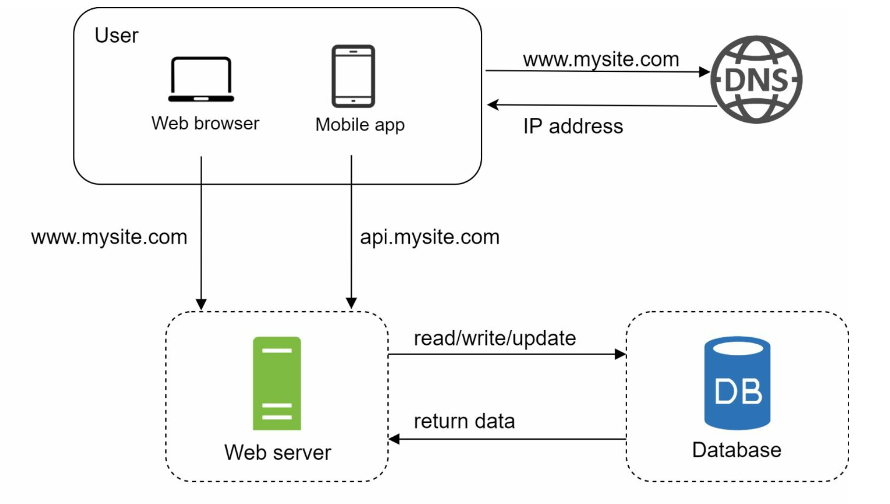
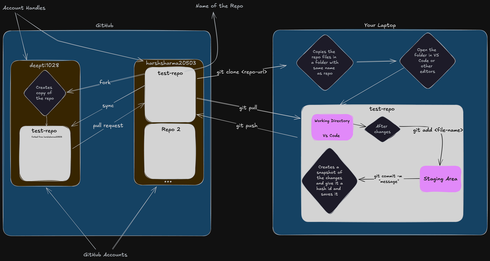

# Session 1

## Part 1: Understanding the Internet (10-15 mins)

`Goal`: Explain the abstract-level functioning of the internet.

- Topics to Cover:
    1. What is the Internet?
        - A global network of interconnected devices.
        - Communication via IP (Internet Protocol).
    2. Key Components:
        - Clients (e.g., Browsers): Request resources from servers.
        - Servers: Respond to client requests with data.
    3. How the Internet Works:
        - The role of DNS (Domain Name System).
        - HTTP/HTTPS requests and responses.

### Architecture

## Part 2: Servers, Browsers, Frontend, and Backend (15-20 mins)

`Goal`: Introduce the structure and roles of different layers in web development.

- Topics to Cover:
    1. Browsers:
        - Examples: Chrome, Firefox, Safari.
        - Role: Rendering frontend code (HTML, CSS, JavaScript).
    2. Servers:
        - Examples: Apache, Nginx, Node.js.
        - Role: Host and serve data to clients.
    3. Frontend (Client-Side):
        - Technologies: HTML, CSS, JavaScript.
        - Purpose: Create user interfaces and manage user interactions.
    4. Backend (Server-Side):
        - Technologies: Node.js, Python, Java, etc.
        - Purpose: Handle business logic, manage databases, and serve responses.

## Part 3: Basics of Git and GitHub (20-25 mins)

`Goal`: Teach the basics of version control and introduce Git commands.

- Topics to Cover:
    1. What is Git?
        - A distributed version control system.
        - Importance: Tracking changes and collaborating on code.
    2. What is GitHub?
        - A platform for hosting repositories and collaborating.
    3. Essential Git Commands (Hands-on):
        - `git init` – Initialize a repository.
        - `git status` – Check the status of your repository.
        - `git add .` – Stage all changes.
        - `git commit` -m "message" – Save changes to history.
        - `git push` – Push changes to a remote repository.
        - `git pull` – Pull changes from a remote repository.

### Step to initialise git repo

1. `git init`: Initialize a repository.
2. `git status`: Check the status of your repository.
3. `git add .`: Stage all changes.
4. `git commit -m "message"`: Save changes to history.
5. `git log`: Shows all the commits

### To upload the repo on github

1. Create an account on github.
2. Create a repo on github.
3. In your local repo add the remote repo url: `git remote add origin https://github.com/YadhuGowda07/Session-Notes.git`
4. To check if the remote repo is created: `git remote -v`
5. Push your code to github: `git push -u origin main`
